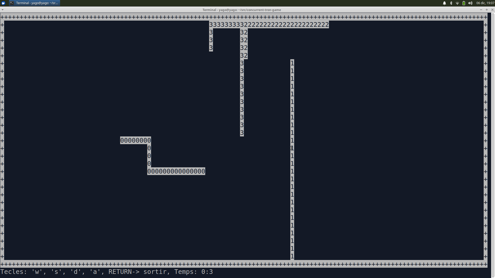

# Multithreaded Tron game using CSP model 
This repository contains the implementation of the tron game carried on with **threads** and **processes**. Support one player against  multiple machine players.  Every oponent is spawned as a process with fork(), and the player as a thread of the main process. The communication between them it's done with the power of [CSP model](https://www.cs.cmu.edu/~crary/819-f09/Hoare78.pdf) through IPC queues. 

Once the main program it's running will create a set of processes that will stop until all the players are ready. The players communicate the collisions in a centralized way to the father process, in order to create non-blocking operations each player has multiple threads. This game takes care mainly about synchronization with the help of mutex and message queues. 


## Rules 
Every player has one life, in case that the player crash against the wall will die, if hit against another player the first will die and the second will start writing the trail in different color. If some other player passes over that trail, the trampled one will be notified and will die. 

## Compilation 
In order to get the game running:
```bash
$ make 
$ ./tron 6 historic-file 1  
```
Where the first argument is the number of opponents (MAX_OPONENTS limit),  the second is the file results, the third the degree of variation and the fourth (optional) the delay between turns. It is recommended to run this program in a BSD system. 

